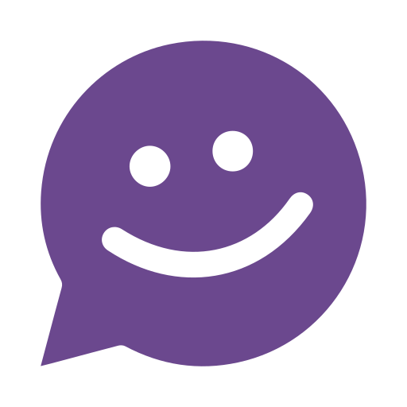
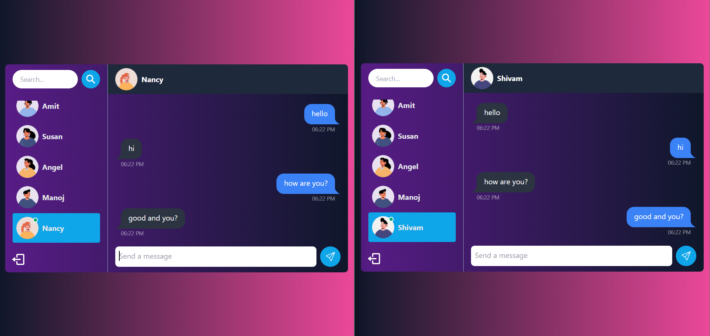

<<<<<<< HEAD
<p align="center"></p>

<h1 align="center" id="title">GoChat : Realtime Chat App</h1>

<h4> This is a realtime chat application built with the MERN stack (MongoDB Express.js React.js Node.js) along with Socket.io for real-time messaging. The frontend is styled using TailwindCSS with Daisy UI components.</h4>

## 🖥️ Tech Stack

<h3>Fontend:</h3>
<p align="left">
&nbsp;&nbsp;
&nbsp;&nbsp;
&nbsp;&nbsp;
&nbsp;&nbsp;
</p>

<h3>Backend:</h3>
<p align="left">
&nbsp;&nbsp;
&nbsp;&nbsp;
&nbsp;&nbsp;
</p>


<h3>Deployed On:</h3>
<p></p>


<h2>🚀 Demo</h2>

[https://go-chat-lpn0.onrender.com](https://go-chat-lpn0.onrender.com)

<h2>Project Snapshot:</h2>


<h2>⚡️ Features</h2>

- **Tech stack**: MERN + Socket.io + TailwindCSS + Daisy UI
- **Authentication & Authorization**: Implemented using JWT (JSON Web Tokens) for secure user authentication and authorization.
- **Real-time messaging**: Utilizes Socket.io for real-time messaging between users.
- **Online user status**: Shows the online status of users in real-time using Socket.io and React Context.
- **Global state management**: Zustand is used for managing global state across the application.
- **Error handling**: Comprehensive error handling implemented both on the server and the client side.

<h2>🚩 Getting Started</h2>

### Clone the repository:
```bash
git clone <https://github.com/Azarex145/go-chat.git>
```
### Navigate to the project directory:
```bash
cd realtime-chat-app
```

### Setup .env file in the root directory
```js
PORT=...
MONGO_DB_URI=...
JWT_SECRET=...
NODE_ENV=...
```

### Build the app
```shell
npm run build
```

### Start the app
```shell
npm start
```

### Open your browser and go to 
```
http://localhost:5000
```
=======
GoChat
>>>>>>> e028d3b6989a6d39b6c4ed9b45f43b5029e1b5ab
